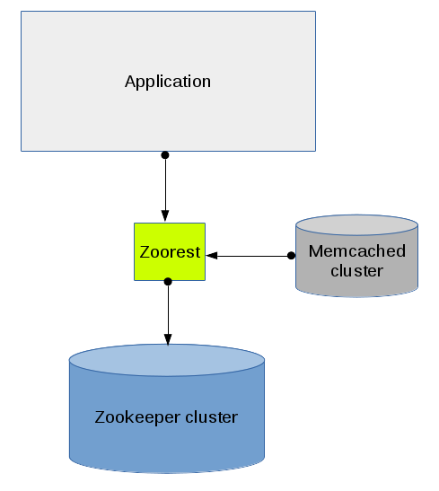

# Zoorest 
[](https://travis-ci.org/Difrex/zoorest)

Zookeeper HTTP rest API
<!-- markdown-toc start - Don't edit this section. Run M-x markdown-toc-generate-toc again -->
**Table of Contents**

- [Zoorest](#zoorest)
    - [Usage](#usage)
    - [API](#api)
        - [List node childrens](#list-node-childrens)
            - [Errors](#errors)
        - [Get node data](#get-node-data)
            - [Errors](#errors)
        - [Create node recursive](#create-node-recursive)
        - [Create node children](#create-node-children)
            - [Errors](#errors)
        - [Update node](#update-node)
            - [Errors](#errors)
        - [Delete node recursive](#delete-node-recursive)
            - [Errors](#errors)
    - [Build](#build)
        - [Binary](#binary)
        - [Docker build](#docker-build)
            - [Binary file](#binary-file)
            - [Docker image](#docker-image)
    - [Get docker image](#get-docker-image)
- [AUTHORS](#authors)
- [LICENSE](#license)
- [DONATE](#donate)

<!-- markdown-toc end -->

## Usage

```
Usage of ./zoorest:
  -listen string
    	Address to listen (default "127.0.0.1:8889")
  -mc
    	Enable memcached support
  -mchosts string
    	Memcached servers. Comma separated (default "127.0.0.1:11211")
  -mcprefix string
    	Memcached key prefix (default "zoorest")
  -path string
    	Zk root path (default "/")
  -zk string
    	Zk servers. Comma separated (default "127.0.0.1:2181")
```

NOTE: If memcached support is enabled zkStat metrics will not be returned.

Tupical usage scheme:

[](img/usage.png)

## API

### List node childrens

Method: **GET**

Location: **/v1/ls**

Return JSON
```json
curl -s -XGET http://127.0.0.1:8889/v1/ls/ | jq
{
  "childrens": [
    "two",
    "three",
    "one"
  ],
  "path": "/zoorest",
  "state": "OK",
  "error": ""
}
```

#### Errors

```json
curl -s -XGET http://127.0.0.1:8889/v1/ls/does/not/exist | jq
{
  "childrens": null,
  "path": "",
  "state": "ERROR",
  "error": "zk: node does not exist"
}
```

### Get node data

Method: **GET**

Location: **/v1/get**

Return JSON
```
curl -s -XGET http://127.0.0.1:8889/v1/get/one/data | jq
{
  "path": "/zoorest/one/data",
  "state": "OK",
  "error": "",
  "data": "eyJzb21lIjogImpzb24ifQ=="
}
```
Node data stored in *data* field as base64 encoded string
```
echo eyJzb21lIjogImpzb24ifQ== | base64 -d
{"some": "json"}
```

#### Errors

```json
 curl -s -XGET http://127.0.0.1:8889/v1/get/does/not/exist | jq
{
  "path": "",
  "state": "ERROR",
  "error": "zk: node does not exist",
  "data": null
}
```

### Create node recursive

Method: **PUT**

Location: **/v1/up**

Return string with created path
```
curl -XPUT http://127.0.0.1:8889/v1/up/two/three/four -d '{"four": "json"}'
/zoorest/two/three/four
```

### Create node children

Method: **PATCH**

Location: **/v1/up**

Return string with created children path
```
curl -XPATCH http://127.0.0.1:8889/v1/up/one/test -d 'test'
/one/test
```

#### Errors

```
curl -XPATCH http://127.0.0.1:8889/v1/up/six/test -d '{"six": "json"}'
zk: node does not exist
```

### Update node

Method: **POST**

Location: **/v1/up**

Return string with updated path
```
curl -XPOST http://127.0.0.1:8889/v1/up/two -d '{"two": "json"}'
/zoorest/two
```

#### Errors

```
curl -XPOST http://127.0.0.1:8889/v1/up/twa -d '{"two": "json"}'
zk: node does not exist
```

### Delete node recursive
Method: **DELETE**

Location: **/v1/rmr**

Return string with removed path
```
curl -XDELETE http://127.0.0.1:8889/v1/rmr/two
/zoorest/two
```

#### Errors
```
curl -XPOST http://127.0.0.1:8889/v1/rmr/two
Method POST not alowed
```

## Build

### Binary

Set GOPATH variable
```
export GOPATH ${HOME}/.local
```

Get source code
```
go get github.com/Difrex/zoorest/rest
```

Get dependencies
```
cd ${GOPATH}/src/github.com/Difrex/zoorest
go get -t -v ./...
```

Build staticaly linked binary
```
go build -ldflags "-linkmode external -extldflags -static"
```

Build dynamicaly linked binary
```
go build
```

Build dynamicaly linked binary with gcc
```
go build -compile gccgo
```

### Docker build

#### Binary file

Build binary file
```
git clone https://github.com/Difrex/zoorest.git
cd zoorest
./build.sh
```
Result binary file will be placed in out/ dir

#### Docker image

Build Alpine based docker image
```
git clone https://github.com/Difrex/zoorest.git
cd zoorest
./build.sh alpine
```

Image will be tagged as zoorest:latest

## Get docker image

Pull image
```
docker pull lessmore/zoorest
```

And run it
```
/usr/bin/docker run -d -p 8889:8889 --name zoorest lessmore/zoorest:latest --zk zoo1:2181,zoo2:2181,zoo3:2181 --path /zoorest/jail --listen 0.0.0.0:8889 -mc -mchosts mc1:11211,mc2:11211,mc3:11211
```

# AUTHORS

Denis Zheleztsov <difrex.punk@gmail.com>

# LICENSE 

GPLv3 see [LICENSE](LICENSE)

# DONATE

BTC 1JCmZQdESKPCrcjUxDRNgt5HaSgUEWZ8pV<br>
DASH XxEWcJgfiAav1gxTtVLGXqE5T66uMA7te7
